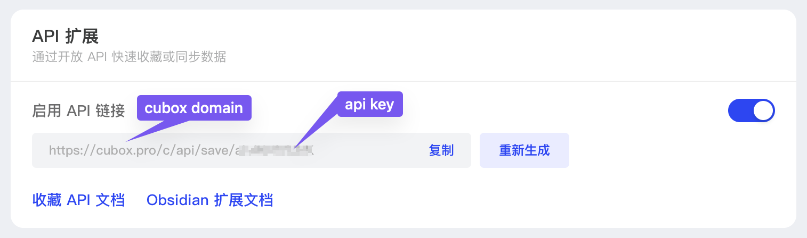

# Cubox-2-Logseq 插件

这个项目的主要用途是将 Cubox (read it later) 的收藏记录、高亮以及笔记内容同步到 Logseq 中。

## 功能特性

- **文章同步**: 将 Cubox 中的文章收藏记录同步到 Logseq。
- **高亮与笔记同步**: 同步文章中的高亮（批注）和笔记内容，确保您的阅读批注不会丢失。
- **增量同步**: 支持基于上次同步的文章 ID 和更新时间进行增量同步，避免重复同步已有的内容，提高效率。
- **按文件夹过滤**: 允许用户指定需要同步的 Cubox 文件夹，只同步特定文件夹下的文章。
- **只同步带批注文章**: 提供选项，只同步那些包含高亮或笔记的文章，方便用户管理。
- **自动页面创建**: 如果目标 Logseq 页面不存在，插件将自动创建。

## 工作原理

插件通过 Cubox API 获取您的收藏数据，并将其转换为 Logseq 兼容的 Markdown 格式，然后写入到您指定的 Logseq 页面中。它会检查文章是否已存在于 Logseq 中，以避免重复导入。

## 使用方法

### 获取 Cubox API Key

1. 打开 https://cubox.pro/my/settings/extensions
2. 开启 `API 拓展`，获取`Cubox domain` 和 `API Key` 如下图所示：
   

### 配置 cubox-2-logseq 插件


（待补充详细的使用说明，例如如何配置 Cubox API Key 和目标 Logseq 页面等）

## 开发

### 前置要求

- [pnpm](https://pnpm.io/) - 快速、节省磁盘空间的包管理器
- Node.js

### 开始开发

1. 克隆仓库：
   ```bash
   git clone https://github.com/stillfox-lee/cubox-2-logseq.git
   cd cubox-2-logseq
   ```

2. 安装依赖：
   ```bash
   pnpm install
   ```

3. 构建：
   ```bash
   pnpm build
   ```

4. 在 Logseq 中加载插件：
    ```
    Settings -> Advanced -> Developer Mode
    Plugins -> Load unpacked plugin -> 选择此项目的根目录
    ```

## 致谢

感谢以下项目和工具对本项目的帮助：

- [logseq-plugin-template-react](https://github.com/pengx17/logseq-plugin-template-react) - 感谢 [@pengx17](https://github.com/pengx17) 提供的优秀模板
- [logseq-readwise-official-plugin](https://github.com/readwiseio/logseq-readwise-official-plugin) - 提供了宝贵的参考和灵感
- [obsidian-cubox](https://github.com/OLCUBO/obsidian-cubox) - 为 Cubox 集成提供了重要参考
- [Logseq](https://logseq.com/) - 感谢这个优秀的知识管理平台
- [Claude](https://claude.ai/) - 本项目使用 Claude Code 开发

## Ref:

- <https://github.com/readwiseio/logseq-readwise-official-plugin>
- <https://plugins-doc.logseq.com/>
- <https://docs.logseq.com/#/page/Plugins%2001>
- <https://github.com/logseq/logseq-plugin-samples>
- <https://logseq.github.io/plugins/modules.html>
- <https://github.com/OLCUBO/obsidian-cubox>